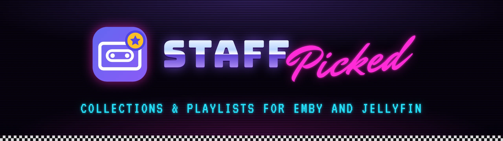
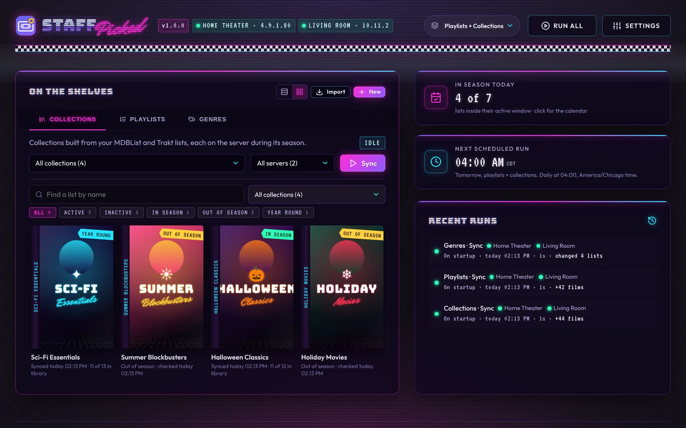
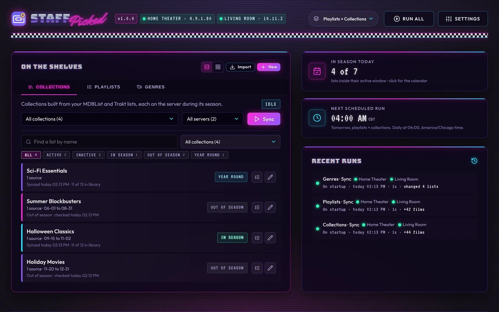
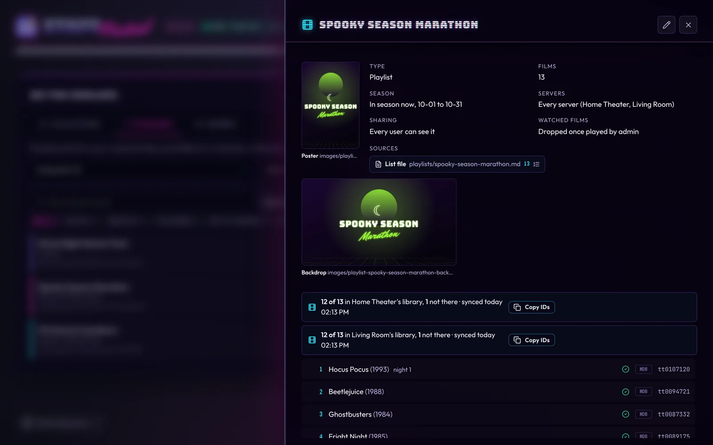
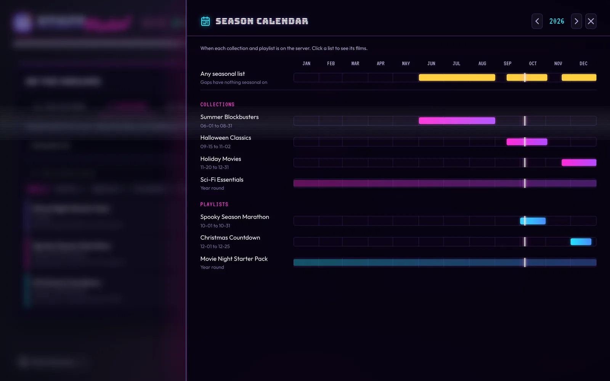
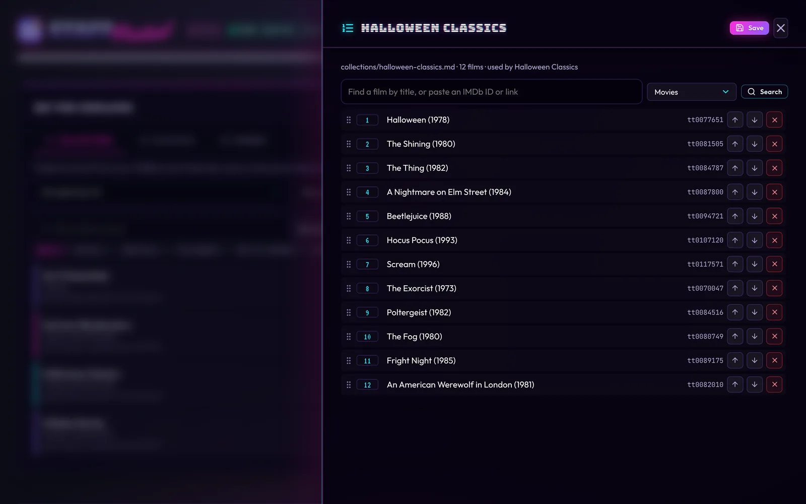
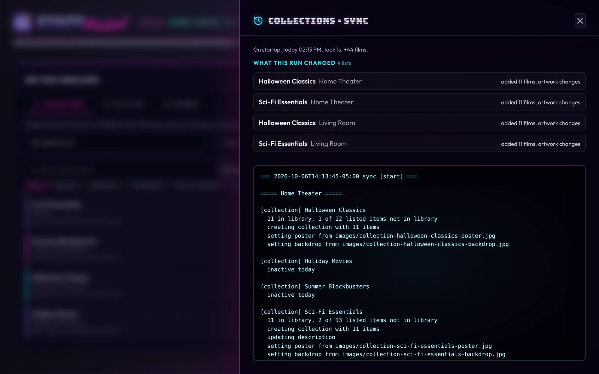
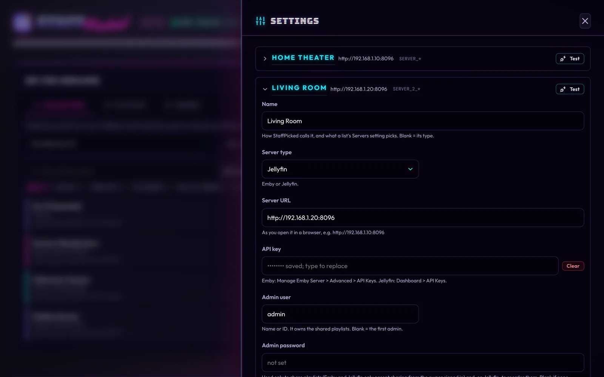
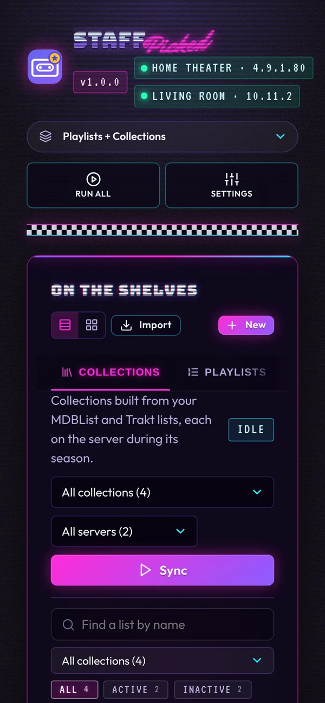

<h1 align="center"></h1>

<p align="center">
  <a href="https://hub.docker.com/r/cj0r/staffpicked"></a>
  <a href="https://hub.docker.com/r/cj0r/staffpicked"></a>
  <a href="https://github.com/cj0r/staffpicked/actions/workflows/tests.yml"></a>
  <a href="LICENSE"></a>
</p>

Named for the shelf of staff picks at the old video store: a few carefully chosen lists, put together by people who care.

StaffPicked builds collections and playlists on Emby and Jellyfin from MDBList lists, Trakt lists and your own Markdown lists, with artwork from TMDB, fanart.tv, MediUX or your own files. It can also give the genres on your server your own artwork. Collections and playlists can be seasonal, appearing only inside a date window. Playlists keep the list's order and can skip what you've already watched. It runs as one Docker container with a web UI, and keeps everything in sync on a schedule (set times each day, or every few hours), on one media server or several at once.

Emby and Jellyfin are supported equally: every feature works on both, you pick the kind for each server in the setup screen (or with `SERVER_TYPE`), and one StaffPicked can keep an Emby server and a Jellyfin server in step at once.



> [!WARNING]
> StaffPicked is provided **as is, with no warranty, and you use it at your own risk**. It creates, changes and **deletes collections and playlists** on your media servers and replaces their artwork, and it holds the API keys for your servers and list services. Try a **dry run** first, and read [Security](#security) and the [Disclaimer](#disclaimer-use-at-your-own-risk) before you put it on a server you care about.

## Features

- Collections and playlists from MDBList (public and private lists), Trakt (lists and watchlists) and your own Markdown list files.
- Posters and backdrops from TMDB, fanart.tv, MediUX, any URL or a local file. Posters you download yourself, from ThePosterDB for example, can be uploaded in the web UI.
- Your own poster, thumb and backdrops on the server's genres (Horror, Comedy, ...).
- Seasonal date windows: a collection or playlist exists on the server only while it's in season. A season calendar shows the whole year at a glance, with overlaps and empty stretches.
- Playlists in list order that drop films once they're watched, shared with every user or built per person. Each sync edits the playlist in place, so pins, home-screen shortcuts and resume spots survive.
- A safety brake: a sync that would take most of a list off the server (a list that came back empty, a library halfway through a rescan) changes nothing for that list until you say so.
- Films that arrive on the server join the lists that were missing them within minutes, without waiting for the next scheduled sync.
- Several media servers at once, Emby and Jellyfin side by side: every server gets everything, or a list can pick its servers.
- Scheduled syncs at set times each day or on an interval, plus a web UI to run, preview and check syncs, edit settings and configs, and read the logs.
- A dry run shows, list by list, which films would be added or removed and what artwork would change; every run keeps the same summary.
- A message to Discord, Slack, Gotify, ntfy or any webhook when a scheduled sync fails, or after every one.
- Shows which films on each list are in your library and which are missing, and when each list last synced. A missing film or show says whether it's already Requested (or downloaded and Available) in Seerr, or in Radarr and Sonarr, and one click requests it if it's truly Missing.
- Shows each film's MDBList score, linked to its MDBList page. Scores are cached, so they cost almost no extra MDBList requests.
- Saves what an MDBList or Trakt list holds today as a list file of your own, to freeze it and edit it by hand.
- Keeps the last versions of every config and list file, so a save can be undone, and downloads or restores the whole config folder as one zip.
- A setup screen on first start, for the media server, list keys and a password, so nothing syncs against a placeholder server.
- A password with optional two-factor sign-in (any authenticator app, plus recovery codes), and ready to sit behind a reverse proxy, at its own domain or under a path. See [Security](#security).
- Rides out rate limits and brief outages at MDBList, Trakt and TMDB by trying again.
- Imports the collections and playlists already on your server, so nothing gets built twice.
- Python standard library only, so the image is small and has no dependencies to keep up to date.

## Screenshots

| | |
|---|---|
|  |  |
| **The shelf.** Every list, whether it's in season, when it last synced and how much of it is in your library. | **A list up close.** Its artwork, season and sharing, and each film marked in the library or missing. |
|  |  |
| **Season calendar.** When each list is on the server, across the whole year. | **Your own lists.** Search for films, paste IMDb links and drag them into order. |
|  |  |
| **Every run explained.** What each sync added, removed and changed, list by list and server by server. | **Emby and Jellyfin together.** One server or several, of either kind, each with its own Test button. |

<p align="center"></p>
<p align="center"><b>On a phone.</b> The whole UI works on a small screen.</p>

## Collections or playlists?

- **Collections** are library shelves everyone sees. Emby and Jellyfin sort them by name or date only, so the list's order is lost. Use them for broad lists ("Halloween", "Trending Movies").
- **Playlists** keep the exact order of the list and can drop films once they're watched. Use them for "watch these in this order" lists.

A collection and a playlist can share a name. StaffPicked only touches collections and playlists named in its configs.

## Bringing in what's already on the server

If your server already has collections and playlists, StaffPicked can take them over instead of building second copies. Open **Import** on the On the Shelves card (or run `python -m scripts import`) to see each one on the server marked as:

- **Managed:** a StaffPicked entry has the same name (capitalization doesn't matter), so sync already updates that one. Collections and playlists are both updated in place.
- **Similar name:** a StaffPicked entry has nearly the same name, like "Indepedence Day" and "Independence Day". **Link** renames the entry to the server's name, so sync updates the existing one instead of building another.
- **Not in StaffPicked:** **Import** saves its poster and backdrop to `images/` and adds an entry for it. For a collection, StaffPicked first looks for the list it was built from: an MDBList or Trakt link in its overview or tags, or else an MDBList list (yours, or a public one with a similar name) whose films in your library are nearly the same as the collection's, combining up to three lists. When it finds one, the collection follows that list, gaining and losing films as the list does. Looking on MDBList needs `MDBLIST_API_KEY`. When no list is found, and for playlists, the films are written, in the server's order, to a new list file (in `collections/` or `playlists/`) as a fixed list. For a collection with no list found, the import screen first asks for its MDBList or Trakt link: paste it and the collection follows that list (the link is checked before anything is saved), or **Skip** to import it as a fixed list. The import screen says which each one gets before you approve it. Imported playlists get `include_watched = true` and `share = "private"`, so nothing about them changes until you edit those settings. Anything without an IMDb ID (or an episode in a playlist) can't go in a list file; it's listed in a comment at the end of the file, and a collection loses it at the next sync.
- **Fixed copy:** a collection StaffPicked manages from a list file (say, from an earlier import). **Use list** switches its entry to the MDBList or Trakt list it was found to come from; when none was found, **Add list** asks for the list's link. The list file stays in `collections/`.
- **Genres:** genres that already have artwork on the server (set by hand in Emby or Jellyfin, or by a metadata plugin) are listed too. **Import** saves the genre's poster, thumb and backdrops to `images/` (`genre-horror-poster.jpg` and so on) and adds a `[[genre]]` entry pointing at them, so StaffPicked keeps that artwork and you can swap any image later. A genre already in `genres.toml` shows as managed. Use `genre:NAME` with `--adopt` for just a genre.
- **Duplicate:** the server already has two with this name. StaffPicked updates only the first collection; for playlists, a sync replaces every playlist with a name StaffPicked manages.

You pick which ones to bring in and review the list before anything is written. Importing and linking only change the config folder: nothing on the server is changed or deleted until the next sync, which then keeps them up to date like any other entry. Playlists are read from the admin user (`SERVER_USER`). With several servers, the import screen has a server picker and `import` goes through each server in turn (`--server` picks one); an imported entry goes to every server like any other.

## Quick start (Docker)

1. Get `docker-compose.yml` and start it. Nothing needs editing first:
   ```bash
   mkdir staffpicked && cd staffpicked
   curl -fsSLO https://raw.githubusercontent.com/cj0r/staffpicked/main/docker-compose.yml
   docker compose up -d
   ```
   This pulls the published image, `cj0r/staffpicked` on Docker Hub (also `ghcr.io/cj0r/staffpicked`), built for `linux/amd64` and `linux/arm64`. To build it yourself instead, see [Building from source](#building-from-source).
2. Open `http://<host>:9343`. On first start StaffPicked fills the `config` folder next to `docker-compose.yml` with example settings and opens a setup screen: your media server (with a **Test** button), optional MDBList and Trakt keys, then a password (or skip it if you only use it at home: without a password the UI only opens from your local network). Nothing syncs until a server is set up. Then add collections, playlists and your own lists in the browser.
3. Enable **Admin Mode** at the top of **Settings** to show the admin tools. Run **Check Config** (under **Config Files**), then **Sync** with **Dry run** ticked to see every change it would make, then **Sync** for real.

The container syncs once at start (once a server is set up) and then on its schedule: every day at each `SYNC_TIME`, or every `SYNC_EVERY` (Settings > Schedule). It re-reads the config folder before every sync, so edits need no restart. Everything you set in the browser is saved to plain files in the config folder (`staffpicked.env`, `collections.toml`, `playlists.toml`, `collections/`, `playlists/`), so you can also edit them by hand. See [web/README.md](web/README.md) for the UI.

The image has a Docker health check, so Dockge, Portainer and `docker ps` show the container as healthy while the web UI answers and its schedule is running.

Optional settings in `docker-compose.yml`: `TZ` (your time zone, for the schedule; UTC otherwise; **Time zone** in the web UI's Settings overrides it), and `PUID`/`PGID` (see [Permissions](#permissions)).

**Compose managers** (Dockge, Portainer, a NAS's container app and the like): paste `docker-compose.yml` in as a new stack and deploy it. The config folder is then created next to the manager's copy of the compose file (Dockge: `/opt/stacks/<stack>/config`); that's the folder to edit or back up. If the manager itself runs in a container, its stacks folder must have the same path inside and outside it (e.g. `/opt/stacks:/opt/stacks`); otherwise Docker creates a separate, empty `config` folder on the host, and edits in the stacks folder never reach StaffPicked. `docker inspect staffpicked` shows which host folder is mounted at `/config`. To use a folder somewhere else, set `CONFIG_PATH` in the stack's `.env`, e.g. `CONFIG_PATH=/srv/staffpicked`. Plain `docker run` works too: pass the same port and volume.

**Updating:** `docker compose pull && docker compose up -d` (or your manager's update button). Your config folder is kept, and new settings get their defaults.

### Unraid

StaffPicked has an Unraid template, [`templates/staffpicked.xml`](templates/staffpicked.xml). Once it's listed in Community Applications, search the **Apps** tab for StaffPicked and install it. The template keeps the config folder in `/mnt/user/appdata/staffpicked`, runs as `99:100` (`nobody:users`), and opens the web UI from the container's icon. Finish the setup in the browser as above.

### Building from source

```bash
git clone https://github.com/cj0r/staffpicked.git && cd staffpicked
docker build -t cj0r/staffpicked:latest .
docker compose up -d
```

The compose file then runs your own build instead of pulling one.

### Permissions

There's nothing to set for most installs. The container starts as root just long enough to make the config folder writable, then runs everything as the folder's owner on the host, so the files it writes stay editable there. A folder Docker created itself (owned by root) is given to `1000:1000`. Under rootless Docker or Podman it stays root in the container, which is already your own user. The log's first line says which user it picked.

To choose the user yourself, set `PUID` and `PGID` (for example `99` and `100` for Unraid's `nobody:users`), or use `user:` / `docker run --user`. With `user:` the container skips the ownership step, so the folder must already be writable for that user. If the folder sits on a network share that refuses ownership changes, the container logs a warning and carries on; make the share writable for that user instead.

## Command line

Every action is also available as a command, in the container or straight from the repo with Python 3.11 or newer:

```bash
docker exec -it staffpicked staffpicked check    # in the running container
python3 -m scripts check                         # from the repo, no Docker
```

| Command | What it does |
|---|---|
| `check` | Validates the settings and configs and lists every problem. Needs no server. |
| `sync` | Builds and updates everything once. |
| `remove` | Deletes every configured collection and playlist from the server (the media is untouched), and takes StaffPicked's artwork off the configured genres (the genres stay). |
| `import` | Lists the collections, playlists and genres with artwork already on the server and whether StaffPicked manages them. With `--adopt "NAME"` (repeatable, or `--adopt all`), imports or links them; see [Bringing in what's already on the server](#bringing-in-whats-already-on-the-server). `collection:NAME`, `playlist:NAME` or `genre:NAME` picks one kind. |
| `schedule` | Runs `sync` on the schedule (`SYNC_TIME` or `SYNC_EVERY`) without the web UI. |
| `reset-login` | Takes off the web UI's password and two-factor sign-in and signs every browser out, for a lost password or authenticator. In Docker only (`docker exec -it staffpicked staffpicked reset-login`). |

| Option | What it does |
|---|---|
| `--dry-run` | Shows every change without making it. |
| `--only "NAME"` | Runs just one collection, playlist or genre. |
| `--server "NAME"` | Runs on just one media server, by its name or its number (see [Several media servers](#several-media-servers)). Without it, every server gets everything meant for it. |
| `--date 2026-10-15` | Pretends it's another day, to test seasonal windows. |
| `--allow-removals` | Lets this run take most of a list off the server; without it, a sync that would remove more than `REMOVAL_LIMIT` percent of a list is held back. |
| `--config DIR` | The config folder. Default: `$STAFFPICKED_CONFIG`, else `/config`, else `config/` next to the code. |
| `--env FILE` | A settings file other than `staffpicked.env` in the config folder. |

## The config folder

Everything you edit lives in one folder, mounted at `/config` in the container:

```
staffpicked.env       shared settings: servers, what to build, API keys, users, schedule
collections.toml      one [[collection]] per collection (created from collections.toml.example)
playlists.toml        one [[playlist]] per playlist (created from playlists.toml.example)
genres.toml           one [[genre]] per genre you give your own artwork (created from genres.toml.example)
collections/          your own lists (*.md) for collections, and their artwork
playlists/            your own ordered lists (*.md) for playlists, and their artwork
list-template.md      the list format, with a prompt for an AI agent to write one
images/               your poster, thumb and backdrop files, plus copies of downloaded ones
  archive/            replaced copies, kept rather than deleted
cache/                remembers uploaded images, renames waiting for a sync, what each list's
                      last sync found, and MDBList scores (created by the app)
backups/              the last 10 versions of each config and list file, from before each save
  restores/           the whole config as it was before each Restore from File (a zip)
web/                  the web UI's password hash, run history and logs (created by the app)
```

**Settings > Backup > Download Config** saves all of it (everything above except `cache/`, `backups/` and the logs) as one zip, and **Restore from File** (Admin Mode) puts one back: its files replace the ones there, others are left alone, and the config as it was is saved in `backups/restores/` first.

Your own `staffpicked.env`, `collections.toml`, `playlists.toml`, `genres.toml` and list files are git-ignored, so pulling updates never conflicts with them; the repository only carries the `.example` copies, the two `example-list.md` files and the template. All four are created from the examples on first start; `staffpicked.env` holds API keys and user names. The TOML configs hold no secrets. Paths inside them are relative to the config folder. Each of the four opens with a commented-out key listing every setting it takes, the values each one accepts and an example, so you can check a setting without leaving the file.

## staffpicked.env

| Setting | What it is |
|---|---|
| `ENABLE_COLLECTIONS`, `ENABLE_PLAYLISTS` | `true` or `false`: what to build. If neither is set, both are built. |
| `ENABLE_GENRES` | `true` (default) or `false`: set the artwork in `genres.toml`. It has nothing to do until you add a genre. |
| `SERVER_TYPE` | `emby` (default) or `jellyfin` |
| `SERVER_URL`, `SERVER_API_KEY` | server address and an API key. Inside the container `localhost` is the container itself, so use the server's LAN address (e.g. `http://192.168.1.10:8096`), or its container name if both share a Docker network. |
| `SERVER_USER`, `SERVER_PASSWORD` | an admin user (name or ID) that owns the shared playlists, and its password, used only to share playlists (and on Jellyfin, to reorder them). Blank user = the first admin. |
| `WATCHED_BY` | users whose viewing drops a film from shared playlists; blank = only `SERVER_USER` |
| `PLAYLIST_USERS`, `LINKED_USERS` | optional per-person playlists (see [Per-person playlists](#per-person-playlists)) |
| `MDBLIST_API_KEY` | MDBList lists, including your own private ones |
| `TRAKT_CLIENT_ID`, `TRAKT_ACCESS_TOKEN` | Trakt lists. The client ID is enough for public lists; private lists and watchlists also need an access token for the owner's account. |
| `TMDB_API_TOKEN` | TMDB images (the v4 "API Read Access Token") |
| `FANARTTV_API_KEY` | fanart.tv images |
| `MEDIUX_API_TOKEN` | MediUX images looked up by movie, collection or set: your own token from your MediUX account |
| `SYNC_TIME`, `SYNC_EVERY`, `SYNC_ON_START` | sync times every day (`HH:MM`, 24-hour, in `TIME_ZONE`; several separated by commas, like `06:00, 18:00`; default `06:00`); or an interval instead (`6h`, `90m`, `1h30m`; at least 15 minutes, counted from the last scheduled sync; blank = use `SYNC_TIME`); and whether to also sync when the container starts (default `true`). A sync still running holds the next one until it ends. |
| `TIME_ZONE` | your time zone, e.g. `America/Chicago`, for the sync time and for which day it is for season windows. Blank = the container's `TZ`. |
| `NOTIFY_URL`, `NOTIFY_ON` | where to hear how the startup and scheduled syncs went: a Discord or Slack webhook, Gotify (`https://gotify.example/message?token=...`), an ntfy topic (`https://ntfy.sh/your-topic`) or any URL that takes a JSON post; and `failures` (default) or `always`. Runs you start yourself don't notify. |
| `REQUEST_SERVICE` | where a missing title is requested from a list window, one at a time: `seerr` (default) sends films and TV shows to Seerr; `arr` sends films to Radarr and shows to Sonarr |
| `SEERR_URL`, `SEERR_API_KEY` | Seerr (Overseerr and Jellyseerr work too). Requests go in as the admin, so they're approved straight away. |
| `RADARR_URL`, `RADARR_API_KEY` | Radarr, for films when `REQUEST_SERVICE=arr` |
| `RADARR_QUALITY_PROFILE`, `RADARR_ROOT_FOLDER`, `RADARR_SEARCH` | the quality profile (by name) and root folder new films get, picked in Settings from what Radarr has (blank = Radarr's first), and whether Radarr starts searching as each is added (default `true`) |
| `SONARR_URL`, `SONARR_API_KEY` | Sonarr, for TV shows when `REQUEST_SERVICE=arr` |
| `SONARR_QUALITY_PROFILE`, `SONARR_ROOT_FOLDER`, `SONARR_SEARCH` | the same for new shows in Sonarr (default `true`) |
| `REMOVAL_LIMIT` | the share of a list, in percent, one sync may take off the server (default `50`; `0` = no limit). A sync that would take more, and at least 3 films, changes nothing for that list and reports it as an error (so it notifies); its list window then offers **Sync Anyway**. Films leaving a playlist because they were watched don't count. |
| `NEW_FILM_CHECK` | how often the web UI looks for films just added to the server: `5m`, `15m` (default), `30m`, `1h` or `off`. A collection or playlist that was missing one syncs straight away, just that list. Nothing needs setting up on Emby or Jellyfin. |
| `DRY_RUN` | `1` previews without changing anything |
| `TRUSTED_PROXIES` | the IP addresses or ranges of your reverse proxy (e.g. `172.18.0.0/16`), comma-separated. Only requests from these may say which browser they're for and that it used https. Blank = trust no proxy. See [Reverse proxy](#reverse-proxy). |
| `URL_BASE` | the path when a proxy serves StaffPicked under one, like `/staffpicked` for `https://example.com/staffpicked/`. Blank = at the root. |

Keys are only needed for the sources and images your configs use; `check` says which ones are missing.

## Security

StaffPicked holds the API keys for your media servers and list services and can change what's on those servers, so treat it like the servers themselves. Set a password, don't forward its port to the internet, and reach it from outside your home only through a reverse proxy with HTTPS and two-factor sign-in, as described below.

### Sign-in

Set a password on the setup screen or in **Settings > Web Access**. Sign-ins last 30 days and survive restarts; only hashes of the password and of each sign-in are kept (`web/web.json`). Changing the password signs out every other browser. Five wrong tries from one address lock it out for five minutes, and each failed attempt is written to the container log with its address (`[auth] wrong password from 203.0.113.7`), so a tool like fail2ban can act on it.

**Without a password, the UI only opens for browsers on your local network** (a private LAN address, or a Tailscale-style `100.x` address) that connect to it directly, by its IP address or a local name like `tower` or `nas.local`. Anything coming in through a reverse proxy, a tunnel, or from the internet gets a page asking for a password to be set first. That keeps a forgotten port forward from exposing your API keys, and stops a hostile web page from reaching the UI through your browser (DNS rebinding).

### Two-factor sign-in

With a password set, **Settings > Two-Factor Sign-In > Set Up** adds a code from an authenticator app (Google or Microsoft Authenticator, 1Password, Bitwarden, Aegis, 2FAS and the like) to every sign-in. Scan the QR code (or type the key), enter the code it shows, and StaffPicked shows 10 recovery codes once: each one signs you in once without the app, so keep them in a password manager. Turning it on signs out every other browser. Turning it off, making new recovery codes and changing the password each ask for the password and a current code. Removing the password turns two-factor sign-in off too.

Lost the password, or the phone and the recovery codes? This takes both off and signs everyone out; then set them again in Settings from your local network (more in [Troubleshooting](#troubleshooting)):

```bash
docker exec -it staffpicked staffpicked reset-login
```

### Reverse proxy

To reach StaffPicked from outside your home, put it behind a reverse proxy with HTTPS (Caddy, nginx, Nginx Proxy Manager, Traefik, SWAG, a Cloudflare tunnel and the like), set a password, and turn on two-factor sign-in. Then:

1. Set **Trusted proxies** (`TRUSTED_PROXIES`, in **Settings > Reverse Proxy**) to your proxy's address, or its Docker network's range (`docker network inspect <network>` shows it, e.g. `172.18.0.0/16`). Then StaffPicked takes the browser's real address from `X-Forwarded-For` (for the sign-in lockout and the log) and knows the browser used HTTPS from `X-Forwarded-Proto`, so the sign-in cookie is marked Secure. Requests from anywhere else can't set those headers.
2. To serve it under a path (`https://example.com/staffpicked/`) instead of its own name (`https://staffpicked.example.com`), set **URL base** (`URL_BASE`) to that path, `/staffpicked`. The proxy may pass the path on or strip it; both work.
3. Live logs and progress come over a long-lived event stream (`/api/events`), so the proxy mustn't buffer responses (StaffPicked sends `X-Accel-Buffering: no` for nginx) or close a connection that's quiet for a while (it sends a keep-alive every 15 seconds).
4. With only the proxy using it, publish the port on the host's loopback address alone, `"127.0.0.1:9343:9343"` in `docker-compose.yml`, or don't publish it at all and put the proxy on the same Docker network.

Caddy:

```
staffpicked.example.com {
    reverse_proxy staffpicked:9343
}
```

nginx, under a path (Caddy sends the forwarded headers by itself; nginx needs them spelled out):

```nginx
location /staffpicked/ {
    proxy_pass http://staffpicked:9343;
    proxy_set_header Host $host;
    proxy_set_header X-Forwarded-For $proxy_add_x_forwarded_for;
    proxy_set_header X-Forwarded-Proto $scheme;
    proxy_buffering off;
    proxy_read_timeout 1h;
}
```

with `URL_BASE=/staffpicked` and `TRUSTED_PROXIES` set to nginx's address. Traefik needs only its router and the trusted range; a `StripPrefix` middleware is optional with `URL_BASE`.

### Good to know

- Every page and API answer carries a strict Content-Security-Policy and no-framing, no-sniffing and no-referrer headers. Changes need a JSON body and a same-site sign-in cookie, and browsers that say a request comes from another site are turned away, so another site can't act through your browser.
- `staffpicked.env` and `web/web.json` are readable only by the container's user. **Download Config** holds every API key, password hash and the two-factor key, so keep that zip private.
- The logs hide every API key, token and password StaffPicked knows, and Settings never sends a saved secret back to the browser, only whether it's set.
- `docker-compose.yml` starts the container with `no-new-privileges`, and it drops root before StaffPicked itself starts.
- Keep it updated: `docker compose pull && docker compose up -d` brings the newest release, with the newest Python and Alpine fixes.

## Several media servers

StaffPicked can keep several servers in step at once, for example an Emby server and a Jellyfin server, or two Emby servers in different houses. The `SERVER_*` settings above are server 1. Each further server takes the same settings with a number after `SERVER_`, and its own playlist viewers:

```
SERVER_2_NAME=Living Room          # optional; blank = its type ("Jellyfin")
SERVER_2_TYPE=jellyfin
SERVER_2_URL=http://192.168.1.20:8096
SERVER_2_API_KEY=...
SERVER_2_USER=                     # and SERVER_2_PASSWORD, SERVER_2_WATCHED_BY,
                                   # SERVER_2_PLAYLIST_USERS, SERVER_2_LINKED_USERS
```

Server 1 can also be named, with `SERVER_NAME`. Two servers can't share a name; unnamed ones of the same type are called "Emby" and "Emby 2". In the web UI, **Settings → Media Servers** has a card per server with **Add Server**, **Test** and **Remove**, and writes these lines for you.

- **What goes where:** every collection, playlist and genre goes to every server. To keep one to some servers, give it `servers = ["Living Room"]` (names, any capitalization). `check` warns about a name that isn't set up, and a sync sends the entry to the rest of its servers.
- **Syncing:** each sync goes through the servers in turn, and a server that's down is reported without stopping the others. Lists are read once and shared. On the dashboard, each On the Shelves tab has a server picker for Sync and the remove buttons, the header shows each server's connection, and Recent Runs shows how each server did.
- **Users differ per server:** admin user, password, watched-by, per-person and linked users are set per server, since each server has its own accounts.
- **Removing a server** from the settings stops syncing to it; what StaffPicked built there stays until you remove it first (pick the server and use the remove buttons, or `remove --server NAME`).

## Sources and images

The same source and image strings work in every config (genres take images only).

Sources (a list's items keep its order):

| Write | For |
|---|---|
| `https://mdblist.com/lists/<user>/<list>` or `mdblist:<user>/<list>` or `mdblist:<list id>` | an MDBList list |
| `https://trakt.tv/users/<user>/lists/<list>` or `trakt:<user>/<list>` | a Trakt list |
| `trakt:<user>/watchlist` | a Trakt watchlist (needs `TRAKT_ACCESS_TOKEN`) |
| `collections/<file>.md`, `playlists/<file>.md` | one of your own list files |

Movies and shows from MDBList and Trakt are matched to your library by IMDb, TMDB or TVDB id, then by title and year. List files are matched by IMDb ID. Anything not in the library is listed in the output and skipped until it arrives.

Images (`poster`, `backdrops` for one or more backdrops, and for genres `thumb`):

| Write | For |
|---|---|
| `images/<file>.jpg` | a file in the config folder (`.jpg`, `.jpeg`, `.png`, `.webp`) |
| `https://...` | any image URL |
| `tmdb:movie/<id>`, `tmdb:tv/<id>`, `tmdb:collection/<id>` | TMDB's best image: textless backdrops first, English posters and thumbs first |
| `tmdb:/<file>.jpg` | one exact TMDB image |
| `fanart:movie/<TMDB or IMDb id>`, `fanart:tv/<TVDB id>` | fanart.tv's most liked image (for a thumb, its wide movie or TV thumb) |
| `mediux:movie/<TMDB id>`, `mediux:collection/<TMDB id>` | MediUX's best set for it: English or textless first, then the most popular |
| `mediux:set/<set id>` or a `https://mediux.pro/sets/<id>` link | that MediUX set's poster or backdrop |
| `mediux:<asset id>` | one exact MediUX image (needs no token) |

MediUX images are downloaded once and kept in `cache/mediux/`; MediUX has no thumbs.

ThePosterDB has no API for apps, so StaffPicked doesn't download from it. To use one of its posters, download it from theposterdb.com yourself, then upload it in the web UI or save it in `images/` and point the config at that file.

Every image that isn't a local file is also saved to `images/`, named after its collection or playlist: `collection-80s-horror-poster.jpg`, `collection-80s-horror-backdrop.jpg`, `collection-80s-horror-backdrop-2.jpg`, and `playlist-...` and `genre-...` for playlists and genres. When the image changes, the old copy is moved to `images/archive/` with the date and time added to its name. Nothing there is ever deleted. You can point a config at a saved copy to stop depending on the URL. Switching a poster or backdrop to a local file leaves the old copy where it is; the Images list shows it as unused.

Images are uploaded again only when the image changes. If an image can't be fetched, the output warns and everything else still syncs.

## collections.toml

```toml
[settings]
use_list_descriptions = false       # use the MDBList/Trakt list description when a collection has none
refresh_new_releases = true         # refresh metadata of new releases so their ratings settle
new_release_added_days = 10         # ...if added within this many days
new_release_released_days = 30      # ...and released within this many days

[[collection]]
name = "80s Horror"
sources = ["https://mdblist.com/lists/someuser/80s-horror"]
active = "09-30 to 11-02"           # optional season window
poster = "images/collection-poster-genre-horror-80s.jpg"
backdrops = ["tmdb:/gE6lGe7f7QtX1R2pRpXu1AgH1hU.jpg"]
description = "Rubber suits and synths."   # optional
sort_name = "0 80s Horror"          # optional; where it sorts on the server
display_order = "release_date"      # optional; release_date or sort_name
servers = ["Emby"]                  # optional; only these servers (default: every server)
```

- **Sync:** each run adds what the lists gained and removes what they lost. Items from all of a collection's sources go into it. To drop a film, remove it from the list, because removing it on the server won't stick.
- **Display order:** `display_order` sets the order of a collection's films on the server, `"release_date"` or `"sort_name"`, the two orders Emby and Jellyfin both offer. Viewers can still pick another sort for themselves in their app. Leave it out to keep whatever is set on the server.
- **Season:** `active = "MM-DD to MM-DD"` repeats every year and may wrap the new year (`"11-30 to 01-01"`); `"2026-09-30 to 2026-11-02"` is a one-off. Outside the window the collection is deleted from the server (the media is untouched) and comes back when the window opens. Leave `active` out to keep it all year.

## playlists.toml

```toml
[settings]
include_watched = false     # false = drop what the watched-by users already played
share = "view"              # view = every other user can see it; private = owner only

[[playlist]]
name = "80s Horror"
sources = ["playlists/80s-horror-priority-list.md"]
active = "09-25 to 10-31"
poster = "playlists/80s-horror-priority-list-poster.jpg"
backdrops = ["playlists/80s-horror-priority-list-backdrop.jpg"]
# include_watched, share and watched_by = ["name"] can also be set per playlist,
# and servers = ["name"] to keep it to some servers (default: every server)
```

- **Order:** items play in list order. With several sources, they play one list after another.
- **Updated in place:** each sync adds, removes and moves films on the existing playlist rather than building a new one, so it stays the same playlist on the server. If a server won't edit a playlist in place, it's built again and the output warns.
- **Season:** works like collections: outside its window the playlist is removed.
- **Watched films:** with `include_watched = false`, a film drops off once **any** user in `WATCHED_BY` has played it, so the playlist shrinks as you watch. Other users' viewing never removes anything. A playlist can name its own `watched_by` users, but keeping names in `staffpicked.env` keeps them out of git.
- **Sharing:** `view` lets every other enabled user see and play the playlist but not edit it. Emby only accepts sharing from the owner signed in, so StaffPicked signs in with `SERVER_PASSWORD` for that one step. The owner also needs **Allow sharing personal content** on (Dashboard → Users → the owner → Profile). If either is missing, the playlist is still built and the output warns. On Jellyfin, `view` makes the playlist public and `private` makes it the owner's alone; a new playlist is made that way from the start, and switching one that's already there takes `SERVER_PASSWORD` too.
- **Jellyfin and the order:** Jellyfin only lets a playlist's owner, signed in, move films around in it, so keeping the list's order in place takes `SERVER_PASSWORD` there. Without it, a playlist whose order changed is built again (same name, new playlist).
- **Removing a playlist from the config:** it stays on the server until you delete it there, or run `remove` before taking it out.
- **Renaming:** rename a collection or playlist in the web UI and the next sync removes the one under the old name from each server the entry goes to, then builds it under the new name; the run log shows both. Only that old name is removed, and never one another entry still uses. A rename made by editing the file by hand isn't tracked, so the old one stays on the server until you delete it there.

### Per-person playlists

A shared playlist is one list for everyone: the server can't hide entries per viewer. To let each person see only the films they haven't watched, set `PLAYLIST_USERS` to their user names. Each of them then gets their own private copy of every playlist, built from their own watched films. No password or sharing is needed in this mode, and `WATCHED_BY` and `share` are ignored. If `SERVER_USER` also has a shared playlist with the same name, it is removed.

To link people, list them in `LINKED_USERS`. When one watches a film, it also drops off the playlists of everyone linked with them. Separate groups with `;`, for example `alice, bob; carol, dan`.

## genres.toml

```toml
[[genre]]
name = "Horror"                                # the genre's name on the server
poster = "images/horror-poster.jpg"            # optional
thumb = "images/horror-thumb.jpg"              # optional; a wide 16:9 card
backdrops = ["images/horror-backdrop.jpg"]     # optional
servers = ["Jellyfin"]                         # optional; only these servers (default: every server)
```

- **What it changes:** the server makes its genres from your films' metadata, so StaffPicked never creates, renames or deletes one. It finds each genre by name (capitalization doesn't matter) and sets the images you give it. A name that isn't on the server is reported and skipped. The web UI suggests the server's genre names as you type, and **Import** brings in genres that already have artwork on the server (see [Bringing in what's already on the server](#bringing-in-whats-already-on-the-server)).
- **Which image shows where:** `poster` is the genre's main (Primary) image, the card both Emby and Jellyfin show for it. `thumb` is a wide 16:9 card that Emby uses in its genre rows when it's set. `backdrops` sit behind the genre's page.
- **Taking it back off:** removing a genre from `genres.toml` leaves its artwork on the server. Delete it in the web UI with **Also take the artwork off** ticked, or run `remove --only "Horror"` first, to remove the images StaffPicked set. Artwork set any other way is left alone.

## Troubleshooting

**Locked out of the web UI** (lost password, lost authenticator, or a password that won't take). Run `reset-login` inside the container. It takes off the password and two-factor sign-in and signs every browser out; no restart needed. Then set a new password in **Settings > Web Access** from your local network.

- From a host shell: `docker exec -it staffpicked staffpicked reset-login`
- From a container console (Dockge, Portainer, Unraid's Docker tab and the like): `staffpicked reset-login`

**"Too many attempts. Try again in a few minutes."** Five wrong passwords or codes from one address lock it out for five minutes. Wait it out, or restart the container to clear it.

**Sent back to the sign-in page right after signing in.** Clear the site's cookies for StaffPicked's address and sign in again. Browsers share cookies between apps on the same address (ports don't separate them), so another app on the same IP can overwrite StaffPicked's sign-in; opening StaffPicked by its own hostname avoids that.

**A page asks for a password to be set first.** Without a password the UI only opens from your local network, by IP address or a local name (see [Sign-in](#sign-in)). Open it that way and set a password; after that it opens through a reverse proxy too (see [Reverse proxy](#reverse-proxy)).

**The container stops with "StaffPicked can't write to /config".** The config folder belongs to a different user than the one StaffPicked runs as. See [Permissions](#permissions).

**Nothing syncs, or a server shows red.** Open **Settings > Media Servers** and press **Test** on each server. The answer says what's wrong, such as an unreachable address or a rejected API key. **Check Config** (under **Config Files**, with Admin Mode enabled) lists any setting a sync would trip on.

**A film on the list never shows up in the collection.** Open the list (click its row): every film is marked in the library or missing. A missing film has to be in your server's library first, and a title with no IMDb ID can't be matched.

## Development

The tests use only the standard library, like the app. From the repo root:

```bash
python -m unittest discover -s tests -t .
```

They cover season windows, list files, the web UI's entry editor, the config files' KEY blocks, retries, backups, and whole syncs against a small fake Emby server (`tests/fake_emby.py`), from the command line and from the web UI.

## List files

A list file is a Markdown file of films in the order you want them. Lists for playlists go in `playlists/`, lists for collections in `collections/`. Put one film per line: its IMDb ID, a `|`, then your own notes (the title, a reason, or nothing at all). A playlist plays them from the top of the file down.

```markdown
# 80s Horror

Carpenter first, then the rest of the decade.

- tt0084787 | The Thing (1982)
- tt0080749 | The Fog (1980), perfect for October
- tt0089175 | Fright Night (1985)
```

Only the IMDb ID is read: the first `tt` number on each line (find it in the film's imdb.com address, like `imdb.com/title/tt0084787/`). Lines without one, such as the title, a description and blank lines, are ignored. Keep the films as one flat list: Emby and Jellyfin playlists have no sections, so headings between films only make the file look like it has some. Shows work too. `check` warns about an ID listed twice and about a line that looks like a film but has no ID.

To add a list, copy `list-template.md` into `playlists/` or `collections/` (or give an AI agent the prompt at its bottom), add a `[[playlist]]` or `[[collection]]` entry pointing at it, and run `check`. The web UI can do all of this for you: **New** starts an empty list or takes a whole list pasted in, AI-written ones included.

## Disclaimer: use at your own risk

**StaffPicked is provided "as is", without warranty of any kind, express or implied.** The [LICENSE](LICENSE) has the full legal text. In plain terms:

- **You use it entirely at your own risk.** The author and contributors accept no responsibility or liability for lost or changed collections, playlists or artwork, wrong metadata, service interruptions, exposed API keys, security incidents, suspended accounts at the services it connects to, or any other damage from using or misusing it.
- **It changes and deletes things on your media servers.** Syncs add and remove films in collections and playlists, a list's season ending deletes its collection or playlist, `remove` deletes everything configured, and artwork is replaced. A collection or playlist you made yourself is changed too if a StaffPicked entry has the same name. Your media files are never touched, but run a **dry run** first and keep backups of your server's data.
- **Check your configuration before running it against a real server.** A wrong list, server or name can change far more than intended, and the author can't undo it for you.
- **Your deployment's security is yours**: network exposure, the password and two-factor sign-in, HTTPS, the reverse proxy and who can read the config folder. See [Security](#security).
- **You're responsible for following the terms of the services you connect it to** (MDBList, Trakt, TMDB, fanart.tv, MediUX and the rest) and of your own API keys, and for having the right to the artwork you use.
- **StaffPicked isn't affiliated with or endorsed by** Emby, Jellyfin, or any of the services it works with. Their names belong to their owners.

It's a hobby project maintained on a best-effort basis, with no guarantee of support or fixes. Report security problems privately, as [SECURITY.md](SECURITY.md) describes, rather than in a public issue.

## Support the project

If StaffPicked keeps your shelves stocked, you can support its development. Every bit is appreciated.

<p>
  <a href="https://ko-fi.com/cj000r"></a>
  <a href="https://www.buymeacoffee.com/cj0r"></a>
</p>

## Contributing and license

Bug reports and pull requests are welcome; see [CONTRIBUTING.md](CONTRIBUTING.md), and [SECURITY.md](SECURITY.md) for reporting a security problem privately. What changed in each release is in [CHANGELOG.md](CHANGELOG.md).

StaffPicked is free software under the [GNU General Public License v3.0](LICENSE). The icons, QR code library and fonts it bundles are under their own licenses, listed in [THIRD_PARTY_NOTICES.md](THIRD_PARTY_NOTICES.md).
